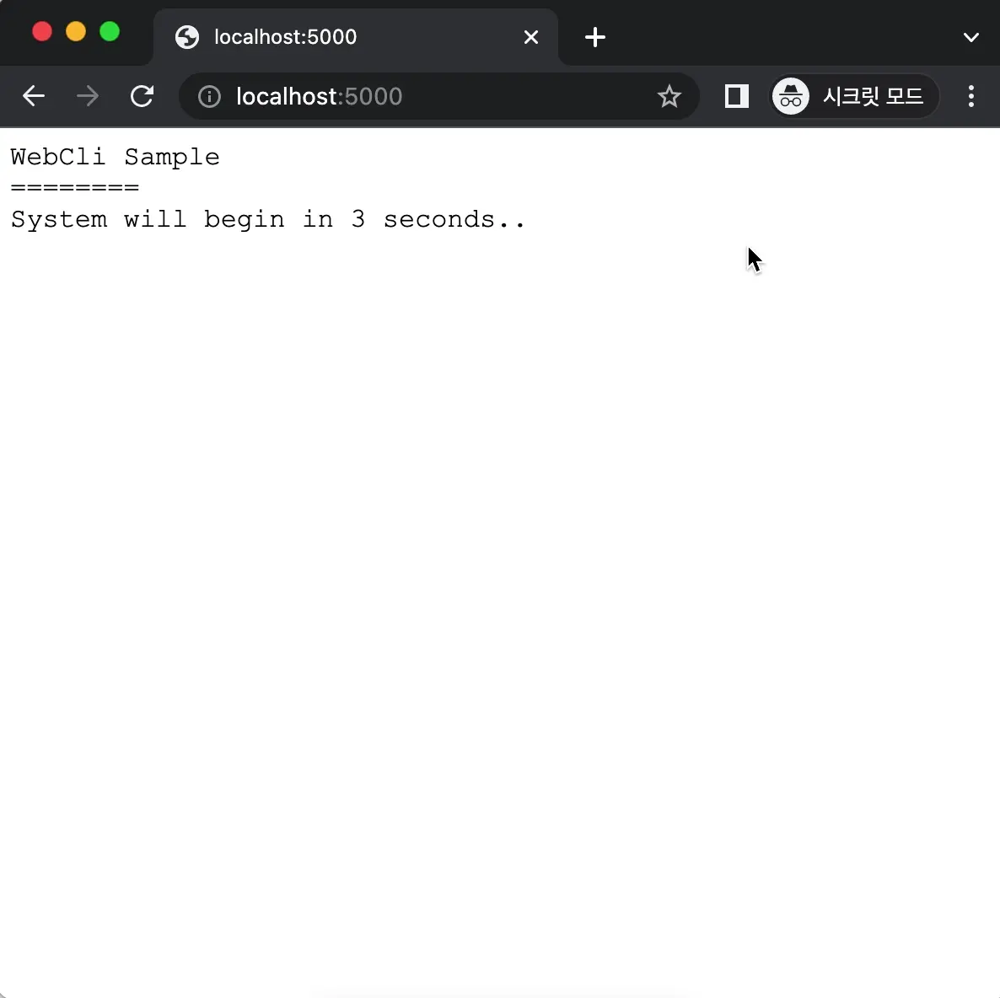

# WebCli

with these simple CLI codes ( [Program.cs](./src/Program.cs) ),

You'll get an interactive browser app :

## Usage

`dotnet run`

The default browser screen with your application will appear.
