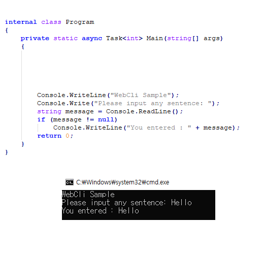

# WebCli

WebCli is a library that handles the output and input of console app in a web browser.

- [NuGet Package](https://www.nuget.org/packages/KayJay.WebCli)


# How to convert exisiting CLI project to WebCLI

1. Add KayJay.WebCli Nuget Package
```
dotnet add package KayJay.WebCli
```

2. Rename your Main() method to WebMain(), And add Main() function as following:

```C#
private static async Task<int> Main(string[] args)
{
    return WebConsole.Init(args, WebMain);
}
```

You'll get an interactive browser app!




# Roadmap

- Various Method
 - WebConsole.WriteFile()
 - WebConsole.WriteImage()
 - WebConsole.WriteTable()
 - WebConsole.ReadPassword()
 - WebConsole.ReadMultiline()
 - WebConsole.ReadFile()
 ...
	